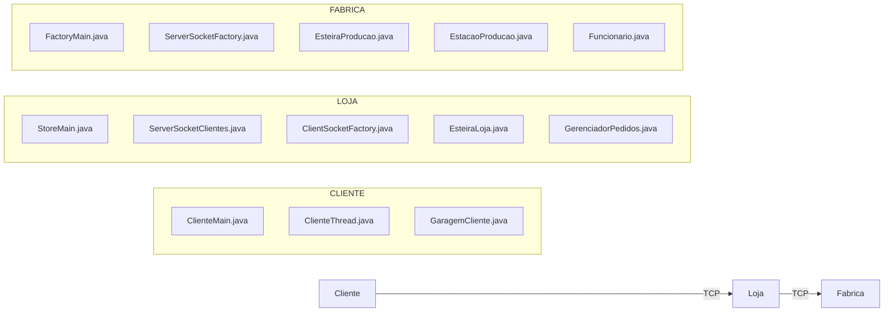
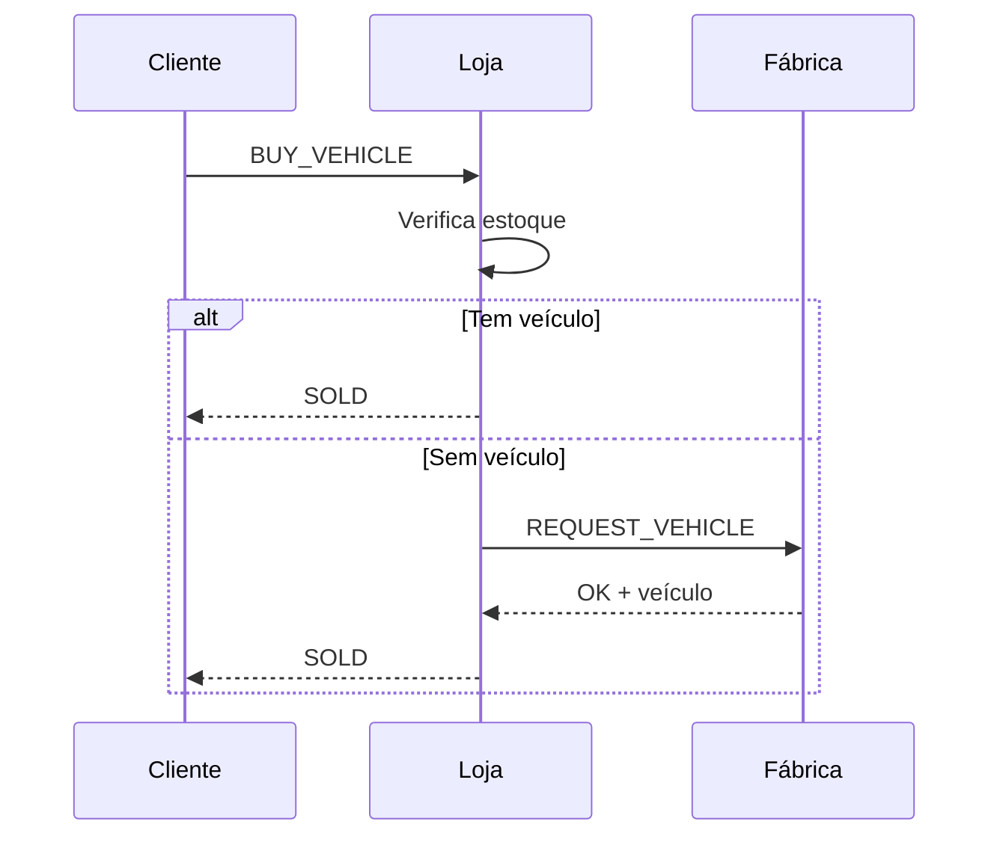

# 🏗️ Arquitetura do Sistema Distribuído

## Fábrica • Loja • Cliente (Java + Sockets + Concorrência)

---

# 📌 Visão Geral

O sistema é composto por **3 programas independentes**:

* 🏭 **FÁBRICA (Servidor)** → produz veículos
* 🏪 **LOJA (Cliente + Servidor)** → intermedia vendas
* 👤 **CLIENTE (Cliente)** → compra veículos

---

# 🧭 Arquitetura Geral



---

# 🔁 Fluxo do Sistema



---

# 🏭 FÁBRICA (Servidor)

## 📌 Responsabilidades

* Produzir veículos (threads)
* Gerenciar estoque de peças (500)
* Controlar esteira (buffer 40)
* Atender requisições das lojas
* Enviar veículos via socket

---

## 🔧 Componentes

* `FactoryMain.java`
* `ServerSocketFactory.java`
* `EsteiraProducao.java`
* `EstacaoProducao.java`
* `Funcionario.java`
* `ControleFerramentas.java` (filósofos)

---

## ⚙️ Concorrência

* Semáforos:

  * Estoque de peças
  * Esteira
* Problema dos filósofos:

  * Cada funcionário precisa de 2 ferramentas

---

# 🏪 LOJA (Intermediário Inteligente)

## 📌 Responsabilidades

* Conectar na fábrica
* Receber requisições dos clientes
* Gerenciar estoque próprio
* Solicitar veículos à fábrica
* Entregar veículos aos clientes

---

## 🔧 Componentes

* `StoreMain.java`
* `ServerSocketClientes.java` → recebe clientes
* `ClientSocketFactory.java` → conecta na fábrica
* `EsteiraLoja.java` → buffer próprio
* `GerenciadorPedidos.java`

---

## ⚙️ Concorrência

* Semáforos:

  * Buffer da loja
  * Clientes concorrentes

---

# 👤 CLIENTE (Programa separado)

## 📌 Responsabilidades

* Conectar na loja
* Solicitar compra
* Receber veículo
* Armazenar na garagem

---

## 🔧 Componentes

* `ClienteMain.java`
* `ClienteThread.java`
* `GaragemCliente.java`

---

# 🔌 Comunicação (Sockets)

## 📡 1. Cliente → Loja

```json
{
  "action": "BUY_VEHICLE"
}
```

---

## 📡 2. Loja → Fábrica

```json
{
  "action": "REQUEST_VEHICLE"
}
```

---

## 📥 Respostas

### Fábrica → Loja

```json
{
  "status": "OK",
  "veiculo": {
    "id": 1,
    "cor": "RED",
    "tipo": "SUV",
    "idEstacao": 2,
    "idFuncionario": 4
  }
}
```

---

### Loja → Cliente

```json
{
  "status": "SOLD",
  "veiculo": { ... }
}
```

---

### Sem estoque

```json
{
  "status": "WAIT"
}
```

---

# 📦 Modelo de Dados (COMPARTILHADO)

```java
class Veiculo {
    int id;
    String cor;
    String tipo;
    int idEstacao;
    int idFuncionario;
}
```

⚠️ **IMPORTANTE:**
Todos os programas devem usar a **mesma estrutura de dados**

---

# 🔒 Controle de Concorrência

## ✔️ Fábrica

* Produção concorrente
* Controle de peças
* Controle da esteira

---

## ✔️ Loja

* Múltiplos clientes simultâneos
* Controle de buffer

---

## ✔️ Cliente

* Threads simulando usuários

---

# ⚠️ Problemas Clássicos

## 🍽️ Jantar dos Filósofos

* Aplicado aos funcionários
* Solução:

  * Ordem fixa de aquisição de ferramentas

---

## 🚫 Evitar

* Deadlock
* Starvation
* Race conditions

---

# 🧾 Logs

## 🏭 Fábrica

* Produção
* Venda para loja

---

## 🏪 Loja

* Recebimento
* Venda para cliente

---

## 👤 Cliente

* Histórico de compras

---

# 🤝 Contrato entre Desenvolvedores

Definir obrigatoriamente:

* Porta da fábrica (ex: 12345)
* Porta da loja (ex: 12346)
* Estrutura JSON
* Nome das ações
* Classe `Veiculo`

---

# 🚀 Etapas de Desenvolvimento

## 🏭 Fábrica

1. Produção com threads
2. Semáforos
3. Buffer
4. Socket server

---

## 🏪 Loja

1. Server de clientes
2. Cliente da fábrica
3. Buffer
4. Integração

---

## 👤 Cliente

1. Threads
2. Conexão com loja
3. Recebimento de veículos

---

# 🧪 Estratégia de Teste

## ✔️ Etapa 1

* Fábrica responde com veículo fixo

---

## ✔️ Etapa 2

* Loja conecta e recebe

---

## ✔️ Etapa 3

* Cliente compra da loja

---

## ✔️ Etapa 4

* Teste com múltiplos clientes

---

# 🔥 Boas Práticas

* Separar responsabilidades
* Validar mensagens
* Tratar exceções de socket
* Usar logs detalhados

---

# 📌 Resumo Final

* Arquitetura distribuída com 3 camadas
* Comunicação via sockets
* Concorrência com semáforos
* Loja como intermediário central
* Sistema escalável e realista

---
