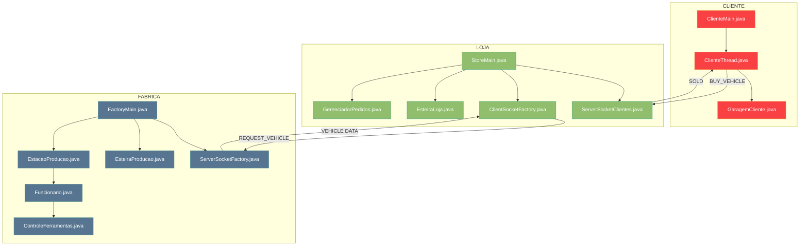

```mermaid
graph TD

    %% =========================
    %% CLIENTE
    %% =========================
    subgraph CLIENTE
        C1[ClienteMain.java]
        C2[ClienteThread.java]
        C3[GaragemCliente.java]
    end

    %% =========================
    %% LOJA
    %% =========================
    subgraph LOJA
        L1[StoreMain.java]
        L2[ServerSocketClientes.java]
        L3[ClientSocketFactory.java]
        L4[EsteiraLoja.java]
        L5[GerenciadorPedidos.java]
    end

    %% =========================
    %% FABRICA
    %% =========================
    subgraph FABRICA
        F1[FactoryMain.java]
        F2[ServerSocketFactory.java]
        F3[EsteiraProducao.java]
        F4[EstacaoProducao.java]
        F5[Funcionario.java]
        F6[ControleFerramentas.java]
    end

    %% =========================
    %% FLUXO INTERNO CLIENTE
    %% =========================
    C1 --> C2
    C2 --> C3

    %% =========================
    %% FLUXO INTERNO LOJA
    %% =========================
    L1 --> L2
    L1 --> L3
    L1 --> L4
    L1 --> L5

    %% =========================
    %% FLUXO INTERNO FABRICA
    %% =========================
    F1 --> F2
    F1 --> F3
    F1 --> F4
    F4 --> F5
    F5 --> F6

    %% =========================
    %% COMUNICAÇÃO ENTRE SISTEMAS
    %% =========================
    C2 -->|BUY_VEHICLE| L2
    L3 -->|REQUEST_VEHICLE| F2

    F2 -->|VEHICLE DATA| L3
    L2 -->|SOLD| C2

    %% =========================
    %% ESTILOS
    %% =========================
    classDef cliente fill:#f94144,stroke:#f3722c,color:#fff;
    classDef loja fill:#90be6d,stroke:#43aa8b,color:#fff;
    classDef fabrica fill:#577590,stroke:#4d908e,color:#fff;

    class C1,C2,C3 cliente;
    class L1,L2,L3,L4,L5 loja;
    class F1,F2,F3,F4,F5,F6 fabrica;
```
