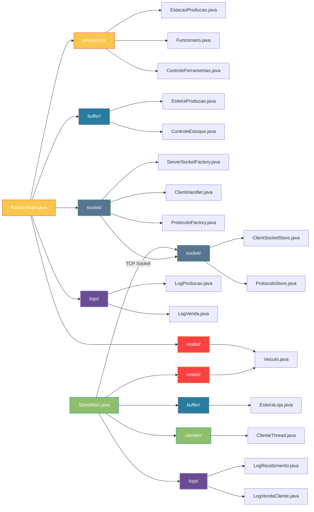

```mermaid
graph LR

    %% =========================
    %% PROGRAMA FÁBRICA
    %% =========================
    A[FactoryMain.java] --> B[production/]
    B --> EstacaoProducao.java
    B --> Funcionario.java
    B --> ControleFerramentas.java

    A --> C[buffer/]
    C --> EsteiraProducao.java
    C --> ControleEstoque.java

    A --> D[socket/]
    D --> ServerSocketFactory.java
    D --> ClientHandler.java
    D --> ProtocoloFactory.java

    A --> E[model/]
    E --> Veiculo.java

    A --> F[logs/]
    F --> LogProducao.java
    F --> LogVenda.java

    %% =========================
    %% PROGRAMA LOJA
    %% =========================
    G[StoreMain.java] --> H[socket/]
    H --> ClientSocketStore.java
    H --> ProtocoloStore.java

    G --> I[buffer/]
    I --> EsteiraLoja.java

    G --> J[clientes/]
    J --> ClienteThread.java

    G --> K[model/]
    K --> Veiculo.java

    G --> L[logs/]
    L --> LogRecebimento.java
    L --> LogVendaCliente.java

    %% =========================
    %% COMUNICAÇÃO
    %% =========================
    D -->|TCP Socket| H

    %% =========================
    %% CLASSES VISUAIS
    %% =========================
    classDef factory fill:#f9c74f,stroke:#f9844a,stroke-width:2px,color:#fff;
    classDef store fill:#90be6d,stroke:#43aa8b,stroke-width:2px,color:#fff;
    classDef socket fill:#577590,stroke:#4d908e,stroke-width:2px,color:#fff;
    classDef buffer fill:#277da1,stroke:#577590,stroke-width:2px,color:#fff;
    classDef model fill:#f94144,stroke:#f3722c,stroke-width:2px,color:#fff;
    classDef logs fill:#6a4c93,stroke:#8e7dbe,stroke-width:2px,color:#fff;

    %% =========================
    %% APLICAÇÃO DAS CLASSES
    %% =========================
    class A,B,C,D,E,F factory;
    class G,H,I,J,K,L store;
    class D,H socket;
    class C,I buffer;
    class E,K model;
    class F,L logs;
```
